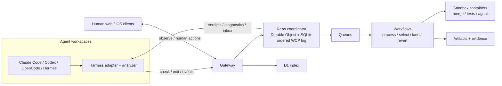

# Weft Coordination Protocol (WCP)

Weft coordinates coding agents while they edit—not only when they open a pull request. Agents submit tool-call edits to a per-repository sequencer. The sequencer validates each edit against accepted changes since the agent's base and returns actionable diagnostics to the agent through its native hooks. Humans see the same event stream and can approve, pause, message, undo, or inspect evidence.

The goal is to make concurrent agent work safer without file locks or requiring agents to stop and wait for a human merge. WCP is the harness-neutral wire protocol; Weft is its Cloudflare-backed implementation and set of adapters.

Live demo: [weft.elier.ai](https://weft.elier.ai) — the web UI over the real event logs of the dogfood repo and the demo runs, public and read-only (no login).

Status: research/demo implementation; WCP v0.1 is a draft, not a published standard. See [the design](docs/design.md), [protocol specification](docs/protocol/wcp-v0.md), and [try it yourself](docs/try-it.md).

## Architecture

Adapters translate harness hooks into WCP requests; the protocol and coordinator do not depend on any one coding agent. Artifacts hosts repos and candidate forks. A single Durable Object per repo assigns event order and validates edits. Workflows orchestrate revision processing, candidate selection, landing, and revert. Sandboxes perform git and test operations without exposing credentials to the agent container. D1 indexes tasks, changes, revisions, and evidence; R2 stores run artifacts. The live demo and preview environment are described in [the runbook](docs/runbook.md).

## Why Cloudflare

- **Workers** provide the gateway, UI, preview service, and product integrations close to the coordination API.
- **Durable Objects with SQLite** give each repository one authoritative ordered log, state machine, and submit queue.
- **Artifacts** supplies the trunk and isolated candidate forks.
- **Queues and Workflows** make push processing, tests, selection, landing, and recovery durable and retryable.
- **Containers / Sandbox SDK** isolate git, builds, tests, and optional agent runs; credentials are mediated outside the container.
- **D1** indexes cross-repo tasks and evidence; **R2** retains logs, transcripts, and screenshots.
- **Workers AI, AI Gateway, and Browser Rendering** support risk/review assistance, attributable model traffic, and visual evidence. They are supporting services, not required to understand the core WCP event model.

The implementation is evolving; the [design](docs/design.md) distinguishes core, strong, and optional product integrations. No production deployment is implied by this repository.

## Try it

Follow [docs/try-it.md](docs/try-it.md) to install the toolchain, run the protocol conformance suite locally, and optionally deploy a preview using your own Cloudflare account. The local path needs no Cloudflare account, API token, or provider credential.

## Standardization

Every coding-agent runtime has hooks; none are interoperable. We propose the hook semantics Weft
runs on as a small open standard, separate from Weft itself:

- [One-pager](docs/standardization/one-pager.md) ([PDF](docs/standardization/one-pager.pdf)): problem, proposal, evidence, ask.
- [Agent Hooks Core v0.1](docs/protocol/hooks-core-v0.md): capability levels L0–L3, normalized lifecycle events, the allow/advise/deny decision envelope, diagnostics, failure policy, host mappings. [WCP](docs/protocol/wcp-v0.md) is its coordination extension.
- [Conformance suite](packages/conformance/README.md) (`wcp-hook-conformance`): runs any hook command through the core fixtures and reports the level it verifies. See the [reports for the Weft adapters](docs/standardization/reports/README.md).
- [3-minute video](https://weft-media.elier.ai/weft-demo-short.mp4) for meetings.

Discussions are open: [github.com/celador/weft/discussions](https://github.com/celador/weft/discussions).

## Repository map

- `packages/protocol` — WCP types, schema, validator, reference coordinator, and conformance fixtures.
- `packages/conformance` — standalone hook conformance runner for Agent Hooks Core (`wcp-hook-conformance`).
- `packages/analyzer` — TypeScript diff-to-symbol read/write analysis.
- `packages/adapters` — harness-specific hook translators.
- `apps/gateway`, `apps/workflows`, `apps/sandbox`, `apps/web` — coordination API, durable jobs, isolated execution, and human UI.
- `demo/` — scenarios, drivers, and recorded evidence.
- `docs/` — design, protocol, runbooks, and [AAIF proposal](docs/proposal-aaif.md).

## License

MIT; see [LICENSE](LICENSE).
